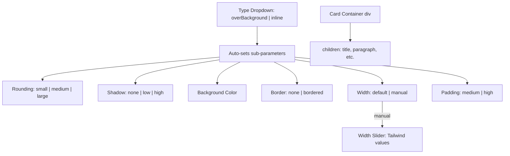

# Card Component Implementation

## Architecture Overview

The Card is a **container component** (like `column`/`flexContainer`) that renders child components inside a styled wrapper. Users drag/drop title, paragraph, etc. into the Card. It has a "type" dropdown that auto-fills sub-parameters, but all sub-parameters remain individually adjustable after a type is selected. For now, only `title` and `paragraph` children are allowed.




## Files to Modify (6) + 1 New File

### 1. NEW: `[src/components/content/CardComponent.tsx](src/components/content/CardComponent.tsx)`

A styled container component. Receives card style props + a `children` ReactNode slot. Renders a `<div>` with the appropriate styles and passes through children.

- **Rounding**: `small` = `rounded`, `medium` = `rounded-lg`, `large` = `rounded-2xl`
- **Shadow**: `none` = none, `low` = `shadow-sm`, `high` = `shadow-lg`
- **Border**: `bordered` = `border border-gray-600`
- **Width**: `default` = `max-w-[60ch]`, `manual` = uses a Tailwind `max-w-*` class from slider
- **Padding**: `medium` = `p-6`, `high` = `p-10`
- **Background**: applied as inline style (supports any hex/color value including transparent)
- Accepts `children: ReactNode` and `isEmpty: boolean` (to show a drop hint when empty, like Column does)
- Accepts drag event handlers (`onDragOver`, `onDrop`) so components can be dragged into it

### 2. `[src/types/website.ts](src/types/website.ts)`

Add `'card'` to the `ComponentType` union (line 1). Add card props to `ComponentProps`:

```typescript
// Card props
cardType?: 'overBackground' | 'inline'
cardRounding?: 'small' | 'medium' | 'large'
cardShadow?: 'none' | 'low' | 'high'
cardBackgroundColor?: string
cardBorder?: 'none' | 'bordered'
cardWidth?: 'default' | 'manual'
cardWidthManual?: string   // e.g., 'max-w-sm', 'max-w-md', etc.
cardPadding?: 'medium' | 'high'
```

No `cardTitle` or `cardContent` -- content comes from child components.

### 3. `[src/utils/componentFactory.tsx](src/utils/componentFactory.tsx)`

Import `CardComponent` and add a `case 'card':` in the switch. This follows the same pattern as `column` -- it needs `renderChildren`, drag handlers, and renders children inside the CardComponent. Only allow `title` and `paragraph` children to be dropped into a card (enforce in drop handler or palette filtering).

### 4. `[src/hooks/useWebsiteBuilder.ts](src/hooks/useWebsiteBuilder.ts)`

Two changes:

- Add `'card'` default props in `getDefaultProps()` (around line 203). Defaults match the "overBackground" preset (no title/content props):

```typescript
case 'card':
  return {
    ...baseProps,
    cardType: 'overBackground',
    cardRounding: 'large',
    cardShadow: 'high',
    cardBackgroundColor: '#ffffff',
    cardBorder: 'none',
    cardWidth: 'default',
    cardPadding: 'high',
  }
```

- In `addComponent()` (line 258), add `'card'` to the condition that initializes `children: []`:

```typescript
children: type === 'flexContainer' || type === 'column' || type === 'card' ? [] : undefined,
```

### 5. `[src/components/builder/ComponentPalette.tsx](src/components/builder/ComponentPalette.tsx)`

Add `{ type: 'card', label: 'Card', category: 'Content' }` to the `componentTypes` array (line 11).

### 6. `[src/components/builder/ConfigurationPanel.tsx](src/components/builder/ConfigurationPanel.tsx)`

Add a `{componentType === 'card' && (...)}` section. This contains only the card's visual styling controls (no title/content fields -- those are separate child components):

- **Type dropdown** (`overBackground` / `Inline`) -- when changed, auto-sets all sub-parameters to the preset values
- **Rounding** -- 3-option radio/button group (Small / Medium / Large)
- **Shadow** -- 3-option radio/button group (None / Low / High)
- **Background Color** -- a palette of clickable color squares in 2 groupings:
  - "Core Colors": blue (`#3b82f6`), yellow (`#eab308`), white (`#ffffff`), transparent
  - "Custom": a range of Tailwind light colors (red-200, orange-200, amber-200, green-200, teal-200, cyan-200, sky-200, indigo-200, violet-200, pink-200, etc.)
  - Each square is ~24x24px with a border, highlighted when selected
- **Border** -- 2-option toggle (None / Bordered). Bordered uses `border-gray-600`
- **Width** -- 2-option toggle (Default / Manual)
  - If Manual: a slider appears with stops at standard Tailwind `max-w` values (xs, sm, md, lg, xl, 2xl, 3xl, 4xl, 5xl, 6xl, 7xl, full)
- **Padding** -- 2-option toggle (Medium / High)

### 7. `[src/config/sampleConfigs.json](src/config/sampleConfigs.json)`

Add a new entry `"Card example"` to the `configs` array. Layout in Tab 1:

1. **overBackground Card** (large rounding, high shadow, white bg, no border, high padding) containing:
  - A `title` child: "Featured Article"
  - A `paragraph` child: sample content text
2. An **h2** heading: "Related Content"
3. **Inline Card** (medium rounding, no shadow, white bg, bordered, medium padding) containing:
  - A `title` child: "Additional Information"
  - A `paragraph` child: sample content text
4. Two **paragraph** components with dummy text

