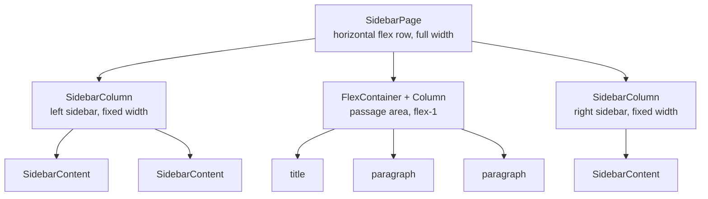

# Sidebar Page Feature

## Architecture Overview

Three new component types compose the sidebar layout system. They are isolated from existing layout components (FlexContainer/Column) to avoid regressions.




The key design: **SidebarPage** is a free-form horizontal flex container. You author children in any order -- `SidebarColumn, FlexContainer (for passage), SidebarColumn` -- no guardrails enforced. The passage area uses existing FlexContainer/Column components normally.

---

## New Component Types

Add to `ComponentType` in [src/types/website.ts](src/types/website.ts):

```typescript
| 'sidebarPage'
| 'sidebarColumn'
| 'sidebarContent'
```

---

## New Props on ComponentProps

Add to `ComponentProps` in [src/types/website.ts](src/types/website.ts):

### SidebarPage props

Minimal -- it's a horizontal flex row. Only uses the existing `name` and `enabled` layer props.

### SidebarColumn props

```typescript
// SidebarColumn props
sidebarColumnWidth?: string              // e.g. "200px", "300px", "25%"
sidebarColumnBgColor?: string            // background color
sidebarColumnBgImage?: string            // background image URL
sidebarColumnBgImageRepeat?: 'no-repeat' | 'repeat' | 'repeat-x' | 'repeat-y'
sidebarColumnBgImageSize?: 'cover' | 'contain' | 'auto' | 'stretch'
  // 'cover' = fill proportionally, 'contain' = fit within, 'auto' = natural size,
  // 'stretch' = background-size: 100% 100% (scales to full column height for scrolling pages)
sidebarColumnBgImagePosition?: 'center' | 'top' | 'bottom' | 'left' | 'right'
  | 'top-left' | 'top-right' | 'bottom-left' | 'bottom-right'
```

### SidebarContent props

```typescript
// SidebarContent props
sidebarContentBgColor?: string            // container background color
sidebarContentVerticalAlign?: 'start' | 'center' | 'end'
  // Vertical position in parent SidebarColumn. Implemented via auto-margins:
  //   'start' = default, 'center' = margin-block: auto, 'end' = margin-top: auto
sidebarContentImage?: string              // image URL
sidebarContentImagePosition?: 'center' | 'top' | 'bottom' | 'left' | 'right'
  | 'top-left' | 'top-right' | 'bottom-left' | 'bottom-right'
  // Positions the  within the container via flexbox align-items + justify-content
sidebarContentHeight?: 'grow' | string    // 'grow' = flex:1, or fixed value like "200px"
sidebarContentSticky?: boolean            // sticky positioning
sidebarContentStickyEdge?: 'top' | 'bottom'  // stick to top or bottom
```

---

## New Component Files

### 1. [src/components/layout/SidebarPage.tsx](src/components/layout/SidebarPage.tsx)

A horizontal flex row, full width, min-height fills available space.

```typescript
// Key styles:
display: 'flex'
flexDirection: 'row'
width: '100%'
minHeight: '100%'    // ensures sidebars stretch to content height
```

- Accepts children (SidebarColumn, FlexContainer, etc.)
- Handles drag/drop for adding children
- Shows empty placeholder when no children

### 2. [src/components/layout/SidebarColumn.tsx](src/components/layout/SidebarColumn.tsx)

A vertical flex column with fixed width, background image/color support.

```typescript
// Key styles:
display: 'flex'
flexDirection: 'column'
width: sidebarColumnWidth || '200px'
flexShrink: 0                          // never compress below width
alignSelf: 'stretch'                   // match height of tallest sibling
backgroundColor: sidebarColumnBgColor
backgroundImage: `url(${sidebarColumnBgImage})`
backgroundRepeat: sidebarColumnBgImageRepeat
backgroundSize: mapSize(sidebarColumnBgImageSize)  // 'stretch' -> '100% 100%'
backgroundPosition: mapPosition(sidebarColumnBgImagePosition)  // 'top-left' -> 'top left'
overflow: 'hidden'                     // clip images at column boundary
position: 'relative'
```

- Accepts SidebarContent children
- Handles drag/drop for adding SidebarContent children

### 3. [src/components/layout/SidebarContent.tsx](src/components/layout/SidebarContent.tsx)

A container within SidebarColumn for images, colors, and sticky elements.

```typescript
// Key styles:
display: 'flex'
flexDirection: 'column'
alignItems: mapHAlign(imagePosition)     // horizontal part of 9-position grid
justifyContent: mapVAlign(imagePosition) // vertical part of 9-position grid
backgroundColor: sidebarContentBgColor
flex: height === 'grow' ? '1 1 0%' : '0 0 auto'
height: height !== 'grow' ? height : undefined
// Vertical alignment in parent via auto-margins:
marginTop: verticalAlign === 'end' || verticalAlign === 'center' ? 'auto' : undefined
marginBottom: verticalAlign === 'center' ? 'auto' : undefined
// Sticky positioning:
position: sticky ? 'sticky' : 'relative'
top: sticky && stickyEdge === 'top' ? '0px' : undefined
bottom: sticky && stickyEdge === 'bottom' ? '0px' : undefined
// When sticky, prevent height stretching:
alignSelf: sticky ? 'flex-start' : undefined
```

- Renders an `` element when `sidebarContentImage` is set
- Otherwise acts as a colored/empty container
- Image rendered as `` with `display: block`, `max-width: 100%`, alignment via parent flexbox

---

## Image Position Mapping (shared utility)

The 9-position grid maps to flexbox alignment pairs. This can be a small helper function:


| Position     | justify-content | align-items |
| ------------ | --------------- | ----------- |
| top-left     | flex-start      | flex-start  |
| top          | flex-start      | center      |
| top-right    | flex-start      | flex-end    |
| left         | center          | flex-start  |
| center       | center          | center      |
| right        | center          | flex-end    |
| bottom-left  | flex-end        | flex-start  |
| bottom       | flex-end        | center      |
| bottom-right | flex-end        | flex-end    |


---

## Files to Modify

### 1. [src/types/website.ts](src/types/website.ts)

- Add `'sidebarPage' | 'sidebarColumn' | 'sidebarContent'` to `ComponentType`
- Add all new sidebar props to `ComponentProps` (listed above)

### 2. [src/utils/componentFactory.tsx](src/utils/componentFactory.tsx)

- Import the 3 new components
- Add `case 'sidebarPage':` -- render SidebarPage with drag/drop, recursively render children
- Add `case 'sidebarColumn':` -- render SidebarColumn with drag/drop, recursively render children
- Add `case 'sidebarContent':` -- render SidebarContent, pass all sidebar content props

### 3. [src/components/builder/ComponentPalette.tsx](src/components/builder/ComponentPalette.tsx)

- Add a new "Sidebar" category section with 3 draggable entries:
  - SidebarPage (root layout)
  - SidebarColumn (sidebar panel)
  - SidebarContent (content block)

### 4. [src/components/builder/ConfigurationPanel.tsx](src/components/builder/ConfigurationPanel.tsx)

- Add configuration sections for each new type:

**SidebarPage:** Minimal -- just the layer props (name, enabled). Could add a note like "Add SidebarColumn and FlexContainer children to build your layout."

**SidebarColumn:**

- Width input (text, default "200px")
- Background color picker
- Background image URL input
- Background image repeat dropdown (no-repeat, repeat, repeat-x, repeat-y)
- Background image size dropdown (cover, contain, auto, stretch) with helper text explaining "stretch" mode
- Background image position -- 9-button grid or dropdown (center, top, bottom, left, right, top-left, top-right, bottom-left, bottom-right)

**SidebarContent:**

- Background color picker
- Vertical alignment in parent -- button group (start, center, end)
- Image URL input
- Image position -- 9-button grid or dropdown
- Height mode -- radio/button group: "grow" vs "fixed", with text input for fixed value
- Sticky toggle (checkbox)
- Sticky edge -- button group (top, bottom), shown only when sticky is enabled

### 5. [src/hooks/useWebsiteBuilder.ts](src/hooks/useWebsiteBuilder.ts)

- Add default props in `getDefaultProps()`:
  - `sidebarPage`: `{ enabled: true }`
  - `sidebarColumn`: `{ sidebarColumnWidth: '200px', enabled: true }`
  - `sidebarContent`: `{ sidebarContentHeight: 'grow', sidebarContentVerticalAlign: 'start', enabled: true }`
- Ensure `addComponent` allows nesting: SidebarPage accepts SidebarColumn/FlexContainer children; SidebarColumn accepts SidebarContent children

### 6. [src/config/sampleConfigs.json](src/config/sampleConfigs.json)

- Add a new "Sidebar Example" config entry with `hideTabBar: true` containing:
  - A SidebarPage root with 3 children:
    - Left SidebarColumn (200px) with one SidebarContent (placeholder bg color)
    - Center FlexContainer (column direction, full width) > Column > title + 2 paragraphs of filler text
    - Right SidebarColumn (200px) with one SidebarContent (placeholder bg color)

---

## Implementation Order

The work follows a natural dependency chain:

1. Types first (everything depends on them)
2. New component files (pure rendering, no builder integration needed to test)
3. Component factory (wires rendering into the tree)
4. Builder integration (palette, config panel, default props)
5. Sample config (demonstrates the feature end-to-end)

---

## What This Does NOT Change

- Existing FlexContainer and Column components are untouched
- Existing sample configs are untouched
- No changes to BuilderCanvas, TabComponent, or cross-tab component logic
- The passage/center area uses standard FlexContainer + Column as-is

